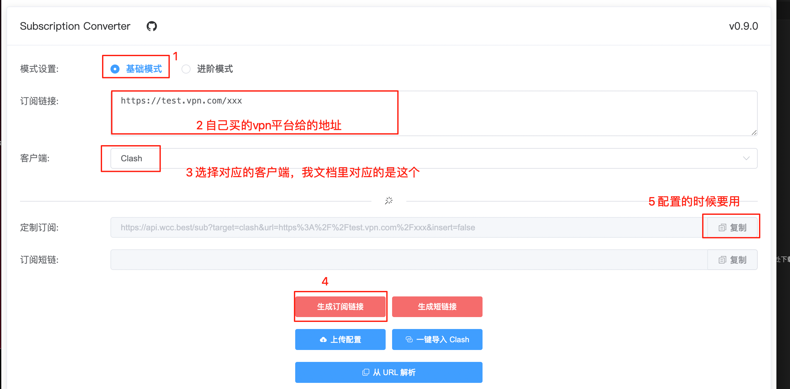
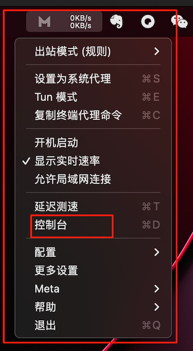
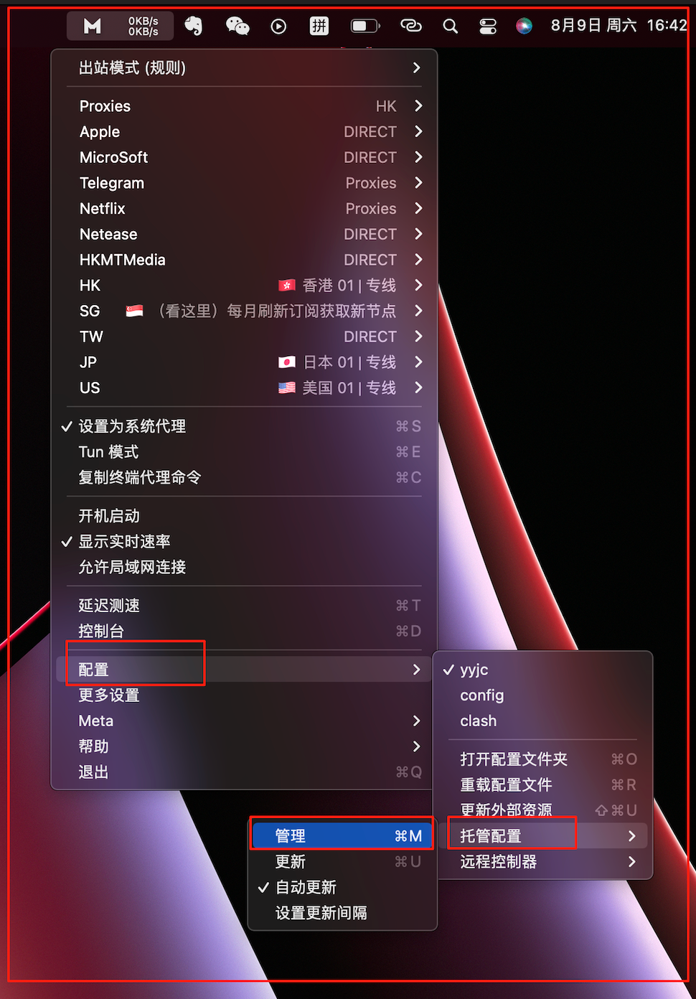
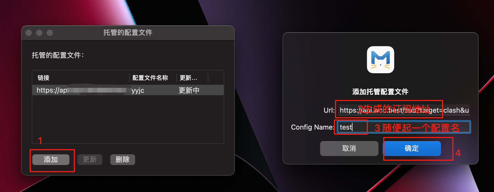
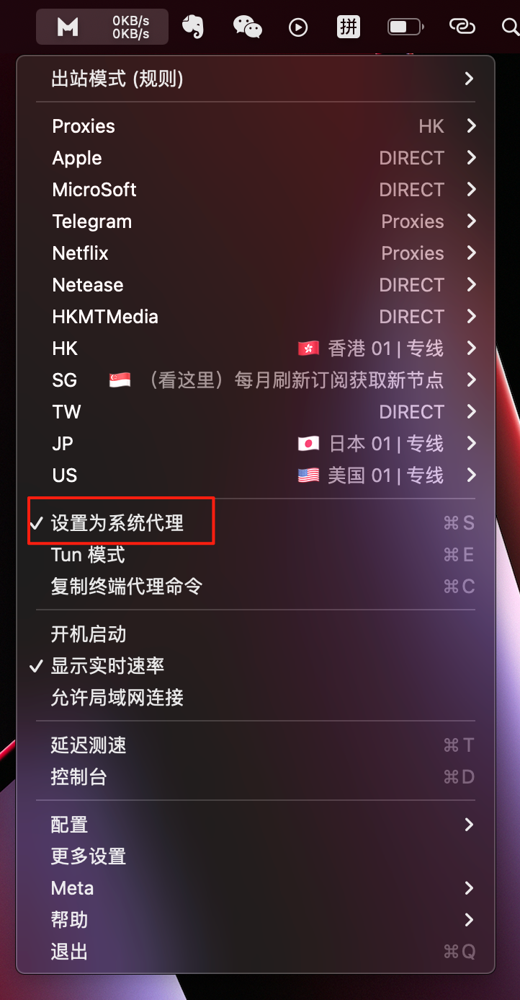
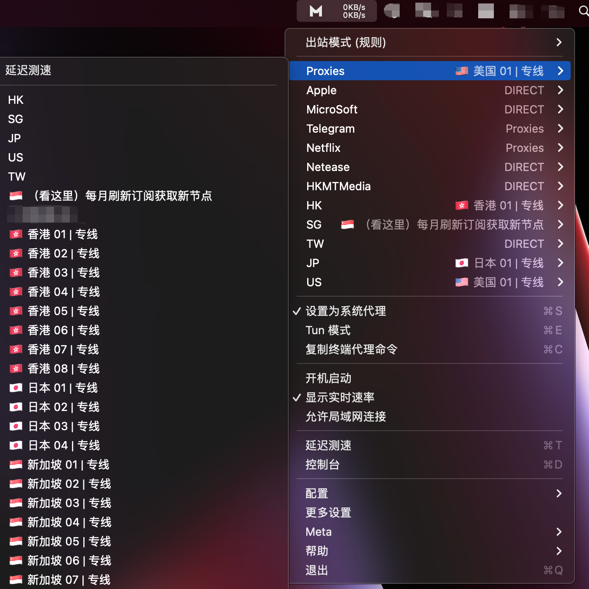
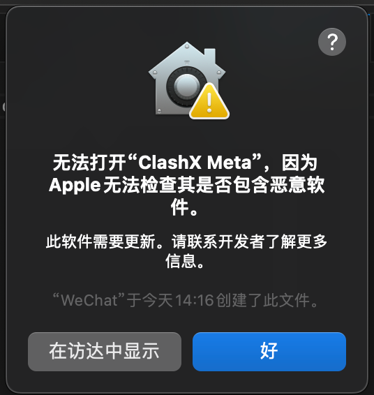
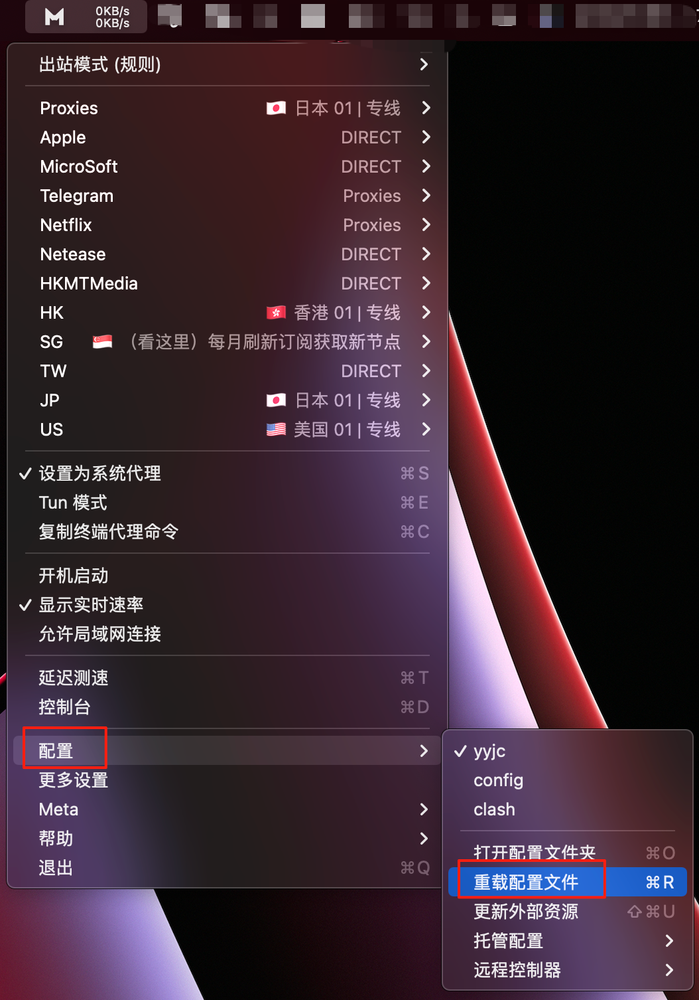

# 安装配置教程
+ 阿里云盘下载地址：[clash安装使用](https://www.alipan.com/s/7xTkTS9173u)
+ 一个vpn网站：https://xn--4gq62f52gdss.com
## mac教程
### 1. 安装
解压 `clash.zip` 文件，安装即可

### 2. 配置
## 2.1 打开安装完成后的软件

## 2.2 搜索在线转换api找到一个转换网址
> 可以直接使用这个网址：`https://sub-web.netlify.app`

## 2.3 生成订阅地址

## 2.4 打开控制台

## 2.5 配置生成订阅地址
### 2.5.1 打开配置面板

### 2.5.2 新增代理配置

### 2.5.3 设置为系统代理

### 2.5.4 选择节点验证是否配置成功
> 随便选个节点都可以

### 2.5.5 验证一下网络
> 可以访问youtube试试：[youtube.com](https://www.youtube.com/)

### 3. 常见错误处理
#### 3.1 错误1: 软件无法打开
**解决方法一：** 修改安全与隐私设置（适用于从可信任来源下载的软件）
1. 点击苹果菜单中的 “系统偏好设置”。
2. 选择 “安全与隐私”。
3. 点击窗口左下角的锁图标，输入你的 Mac 登录密码以解锁设置。
4. 在 “通用” 标签下，找到 “允许从以下位置下载的 App”，选择 “App Store 和被认可的开发者”。这样系统就会允许安装从被认可开发者处下载的软件，对于一些正规渠道下载的非 App Store 软件，大概率可以正常安装运行了。

#### 3.2 错误2: 配置完成后网站无法打开youtube
1. 检查电脑是否断网否正确
2. 检查youtube`https://www.youtube.com` 网址是否正确
3. 切换其他代理节点
4. 重载配置
    
4. 检查或重新配置代理`(重点检查2.3、2.5输入的内容对不对)`
5. 重启软件或重启电脑
